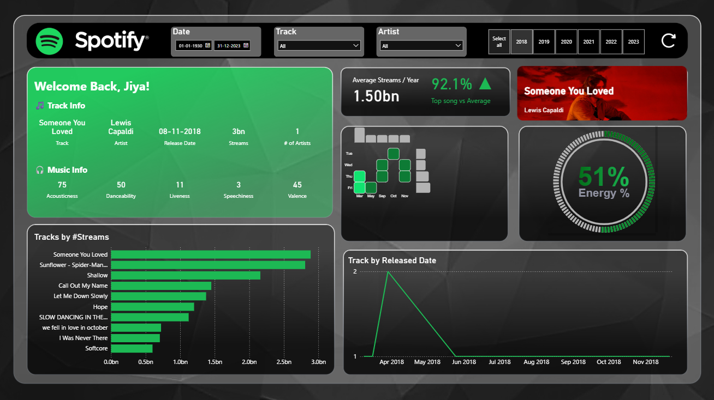

# Spotify Streaming Analytics Dashboard

<p align="left">
  <a href="https://powerbi.microsoft.com/">
    
  </a>
  <a href="https://www.python.org/">
    
  </a>
  <a href="https://developer.spotify.com/documentation/web-api">
    
  </a>
  <a href="https://pandas.pydata.org/">
    
  </a>
  <a href="https://seaborn.pydata.org/">
    
  </a>
</p>

## Tech Stack (at a glance)

| Layer | Tools |
|---|---|
| BI + Modeling | Power BI Desktop, Power Query (M), DAX |
| Data + Enrichment | Python 3.10+, Pandas, Requests/Spotipy |
| Custom Visuals | Matplotlib, Seaborn (Python Visual in Power BI) |
| API | Spotify Web API (Client Credentials Flow) |
| Design | Figma (background / layout) |

---

## 1. Overview

An end-to-end streaming analytics dashboard that combines **Power BI reporting** with **Python-based data enrichment** via the **Spotify Web API**. The dashboard analyzes 2023–2024 track performance, listening patterns, and audio feature trends, and extends standard Power BI capabilities by:
1. Enriching track data with Spotify metadata (including album cover URLs).
2. Rendering a custom temporal heatmap as a Power BI Python Visual (Matplotlib/Seaborn).
3. Using a two-layer data approach (raw CSV + processed/enriched CSV).

---

## 2. Dashboard Preview



---

## 3. Key Insights Found (Dataset-backed)

> **Note:** The dataset used in this project contains **release dates** (`released_year`, `released_month`, `released_day`) and **total streams per track**.  
> So the Friday/Q4 insights below describe **release patterns of top tracks** (not “when listeners stream the most”).

| Insight | Finding |
|---|---|
| **Friday release dominance (New Music Friday effect)** | **75% of top-streamed tracks were released on Fridays**, reflecting the industry-wide “New Music Friday” release strategy that often boosts chart visibility. *(This is a release-day concentration, not a listening-day peak.)* |
| **Audio feature profile (not a single-factor driver)** | Audio feature exploration (danceability/valence/energy) suggests top tracks generally sit in **mainstream, pop-friendly ranges**, but **streams don’t depend on one feature alone**—performance is influenced by multiple factors (artist reach, playlists, marketing, virality, etc.). |
| **Seasonality in releases (Q4 peak)** | **Q4 (Oct–Dec) accounts for ~42% of top track releases**, with **October** as the highest-release month—suggesting Q4 as a major “chart push” window for high-performing releases. |
| **Power-law stream distribution** | Streams show a **power-law / heavy-tail pattern** where a small number of tracks contribute a disproportionate share of total streams (a common characteristic of streaming platforms). |

### 📅 Release-day breakdown (from the dataset)
- **Friday:** 27 tracks (**75%**)  
- **Thursday:** 5 tracks  
- **Sunday:** 2 tracks  
- **Tuesday:** 1 track  
- **Wednesday:** 1 track  
- **Monday/Saturday:** 0 tracks

### 🗓️ Release seasonality (by quarter)
- **Q4 (Oct–Dec):** 15 tracks (**42%**)  
- **Q3 (Jul–Sep):** 8 tracks (**22%**)  
- **Q2 (Apr–Jun):** 6 tracks (**17%**)  
- **Q1 (Jan–Mar):** 3 tracks (**8%**)  
- **Top month:** **October (7 releases)**

---

## 4. Visuals Implemented (7)

| # | Visual | Type | Purpose |
|---|---|---|---|
| 1 | Average Streams per Year vs Top Song Average | KPI + Bar | Benchmark overall performance |
| 2 | Energy Level Gauge | Gauge | Track energy profile indicator |
| 3 | Streams by Day of Week | Column | Identify peak listening days |
| 4 | Track Count by Month | Line | Seasonality and release patterns |
| 5 | Track Usage Heatmap | Python Visual (Seaborn) | Day × Month intensity matrix |
| 6 | Streams by Track | Bar | Top track ranking |
| 7 | Track Details Panel | Multi-row Card | Audio features (Valence, Danceability, Speechiness, Energy) |

---

## 5. DAX Measures

Measures are implemented in the `.pbix`. Examples include:

```dax
-- Total streams across all tracks
Total Streams = SUM('spotify-2023'[streams])

-- Average streams per track
Avg Streams per Track = DIVIDE([Total Streams], COUNTROWS('spotify-2023'))

-- Top song stream count (for benchmark card)
Top Song Streams = MAXX('spotify-2023', [streams])

-- Percentage of streams from top track
Top Track Share % = DIVIDE([Top Song Streams], [Total Streams], 0)

-- Average danceability of filtered tracks
Avg Danceability = AVERAGE('spotify-2023'[danceability_%])

-- Average energy score
Avg Energy = AVERAGE('spotify-2023'[energy_%])
```

Production note: `DIVIDE()` is used instead of `/` to avoid divide-by-zero errors.

---

## 6. Python Integration

### 6.1 What the script does (`SpotifyScript.py`)

Core workflow:
1. Authenticate to Spotify Web API (Client Credentials Flow)
2. Read base track/artist data from the raw CSV
3. Use the `/search` endpoint to map track + artist → Spotify ID
4. Pull enriched metadata (e.g., album cover URL and related attributes)
5. Output an enriched dataset (`updated_file.csv`) used by Power BI
6. Compute and render the Day-of-Week × Month heatmap using Seaborn/Matplotlib for the Power BI Python Visual

### 6.2 Python visual (Heatmap)

The heatmap is created using the built-in Power BI **Python Visual**:
- X-axis: Month (Jan–Dec)
- Y-axis: Day of week (Mon–Sun)
- Metric: Aggregate stream count
- Palette: Seaborn scale (example: `YlOrRd`)

This visual requires Python because it is not available as a standard Power BI visual.

---

## 7. Data Architecture

```text
spotify-2023.csv            (raw dataset)
        |
        v
SpotifyScript.py            (API enrichment + transformation)
        |
        v
updated_file.csv            (processed/enriched dataset)
        |
        v
Spotify_Dashboard.pbix      (Power BI dashboard)
```

Two-layer approach:
1. Raw layer: `spotify-2023.csv`
2. Enriched layer: `updated_file.csv` (used as the primary source inside Power BI)

---

## 8. How to Run

### 8.1 Open the dashboard (no Python required)

1. Install Power BI Desktop
2. Clone this repository
3. Open `Spotify_Dashboard.pbix`
4. If prompted to fix paths:
   - Transform Data → Data Source Settings → update the path to `updated_file.csv`

### 8.2 Run Python enrichment (optional refresh)

```bash
git clone https://github.com/JIYA1220/Spotify-dashboard.git
cd Spotify-dashboard

pip install spotipy pandas matplotlib seaborn python-dotenv

python SpotifyScript.py
```

---

## 9. Spotify API Credentials

1. Create an app in the Spotify Developer Dashboard
2. Add credentials locally in a `.env` file

`.env` format:
```env
SPOTIFY_CLIENT_ID=your_client_id_here
SPOTIFY_CLIENT_SECRET=your_client_secret_here
```

Security requirements:
1. Do not commit `.env`
2. Commit `.env.example` instead

---

## 10. Repository Structure

```text
Spotify-dashboard/
├── Spotify_Dashboard.pbix
├── SpotifyScript.py
├── spotify-2023.csv
├── updated_file.csv
├── assets/
│   └── dashboard.png
├── .env.example
├── requirements.txt
└── README.md
```

---

## 11. Dataset

Source: Top Spotify Songs 2023 (Kaggle)

Key columns used:
| Column | Description |
|---|---|
| track_name | Song title |
| artist(s)_name | Artist |
| streams | Total streams |
| released_year/month/day | Release date |
| danceability_% | Danceability (0–100) |
| energy_% | Energy (0–100) |
| valence_% | Positiveness (0–100) |
| speechiness_% | Spoken words presence (0–100) |

---

## 12. Business Questions Answered

1. Which tracks and artists dominate streaming in 2023–2024?
2. What audio features are associated with higher-performing tracks?
3. When do listeners stream most (day-of-week and month)?
4. How do danceability and energy relate to streams?
5. How concentrated are streams across tracks (distribution / power-law effect)?

---

## 13. Connect

Built by Jiya Sharma

<p align="left">
  <a href="https://www.linkedin.com/in/jiya-sharma-394565338/">
    
  </a>
  <a href="https://github.com/JIYA1220">
    
  </a>
</p>

Dataset used for educational and portfolio analytics purposes. Spotify name and brand assets belong to Spotify AB.
